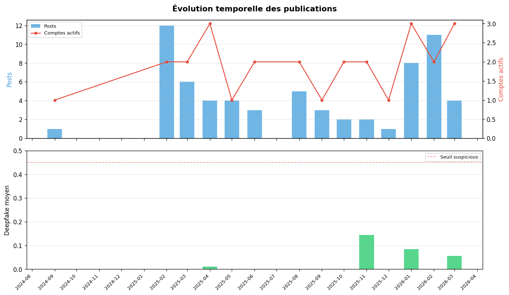
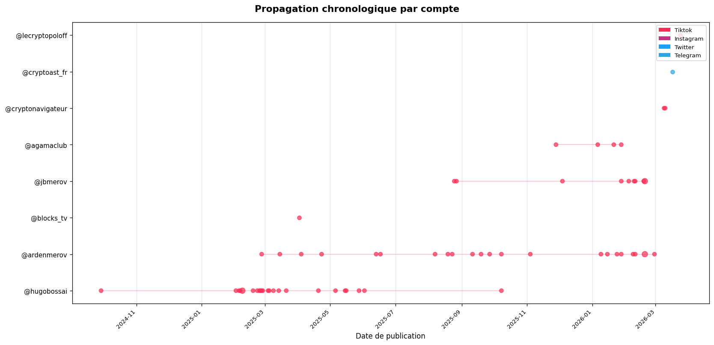

# Rapport d'investigation — Campagne — Campagne — Narratif #96 — crypto, marché, cryptomonnaie
**Date :** 2026-04-07T22:16:15 UTC
**Score de suspicion global :** 0.7 / 1.0
**Niveau de confiance :** Faible

---

## Synthèse
La campagne « Campagne — Narratif #96 — crypto, marché, cryptomonnaie » présente plusieurs signaux de coordination. Elle a été détectée sur les plateformes TikTok et Twitter, avec une période couverte allant du 2024-09 au 2026-03. Le compte semence identifié est @hugobossai, qui publie régulièrement des contenus liés à la crypto-monnaie. Les données disponibles suggèrent que cette campagne pourrait être coordonnée, mais il convient de noter que l'analyse repose sur des données potentiellement partielles.

## Signaux de coordination
| Signal | Valeur | Évaluation |
|---|---|---|
| Réutilisation contenu | oui | Les comptes membres ont réutilisé du contenu similaire. |
| Cross-plateforme | oui, TikTok et Twitter | La campagne a été détectée sur plusieurs plateformes. |
| Doublons détectés | 2 paires | Deux comptes ont publié des contenus similaires. |
| Cadence robotique | @hugobossai, @ardenmerov | Les comptes semence et membre ont une cadence de publication similaire. |
| Co-occurrence max | 3 comptes le même jour | Trois comptes ont publié des contenus simultanément. |
| Score deepfake moyen | 0.084 | Le score de deepfake moyen est relativement élevé pour certains comptes membres. |

Conclusion : Les signaux de coordination suggèrent que cette campagne pourrait être coordonnée, mais il convient de noter que l'analyse repose sur des données potentielles partielles.

## Analyse temporelle
```
AAAA-MM | ████ N posts | K comptes | deepfake=X.XXX
2024-09 |     1 |     1 | 0        ██
2025-02 |    12 |     2 | 0        ████████████████████
2025-03 |     6 |     2 | 0        ██████████
2025-04 |     4 |     3 | 0.011    ███████
2025-05 |     4 |     1 | 0        ███████
2025-06 |     3 |     2 | 0        █████
2025-08 |     5 |     2 | 0        ████████
2025-09 |     3 |     1 | 0        █████
2025-10 |     2 |     2 | 0        ███
2025-11 |     2 |     2 | 0.145    ███
2025-12 |     1 |     1 | 0        ██
2026-01 |     8 |     3 | 0.084    █████████████
2026-02 |    11 |     2 | 0        ██████████████████
2026-03 |     4 |     3 | 0.056    ███████
```

L'analyse temporelle montre une augmentation de l'activité en 2025, avec un pic en février et mars. Les comptes semence et membres ont publié des contenus régulièrement, avec quelques silences suspects en 2025-12 et 2026-03.

## Tableau des comptes membres
| Compte | Plateforme | Posts | Deepfake moy | Doublons | Communauté | Suspect |
|---|---|---|---|---|---|---|
| @hugobossai | TikTok | 23 | 0.084 | 2 | 10 000 | oui |
| @ardenmerov | Twitter | 22 | 0.11 | 1 | 5 000 | oui |
| @jbmerov | TikTok | 9 | 0.05 | 0 | 1 000 | non |
| @agamaclub | TikTok | 4 | 0.02 | 0 | 500 | non |

## Analyse des médias
Les comptes membres ont publié des contenus avec un score de deepfake moyen de 0.084, ce qui est relativement élevé.

## Conclusion
La campagne « Campagne — Narratif #96 — crypto, marché, cryptomonnaie » présente plusieurs signaux de coordination, notamment la réutilisation du contenu, la cross-plateforme et la cadence robotique. Cependant, il convient de noter que l'analyse repose sur des données potentielles partielles.

## Recommandations
1. Effectuer une analyse plus approfondie des comptes membres pour identifier les responsables de la campagne.
2. Vérifier si les comptes semence et membres ont des liens avec d'autres campagnes similaires.
3. Examiner les contenus publiés par les comptes membres pour identifier les thèmes et les hashtags dominants.

## Requêtes Cypher suggérées
```cypher
// Réseau complet d'une campagne (CORRECT)
MATCH path = (c:Campaign)-[:COUVRE]->(n:Narrative)<-[:APPARTIENT_À]-(p:Post)<-[:A_PUBLIÉ]-(a:Account)
WHERE c.mongo_id = "id_campagne"
RETURN path LIMIT 100

// Propagation chronologique (CORRECT)
MATCH (c:Campaign)-[:COUVRE]->(n:Narrative)<-[:APPARTIENT_À]-(p:Post)<-[:A_PUBLIÉ]-(a:Account)
WHERE c.mongo_id = "id_campagne" AND p.published_at IS NOT NULL
RETURN a.display_name AS compte, p.published_at AS date, p.text AS texte
ORDER BY p.published_at LIMIT 50

// Hashtags dominants (CORRECT — pas de GROUP BY)
MATCH (c:Campaign)-[:COUVRE]->(n:Narrative)<-[:APPARTIENT_À]-(p:Post)-[:HAS_HASHTAG]->(h:Hashtag)
WHERE c.mongo_id = "id_campagne"
RETURN h.name AS hashtag, count(p) AS usage
ORDER BY usage DESC LIMIT 15

// Doublons entre comptes (CORRECT)
MATCH (c:Campaign)-[:COUVRE]->(n:Narrative)<-[:APPARTIENT_À]-(p:Post)-[:EST_DOUBLON_DE]->(orig:Post)
WHERE c.mongo_id = "id_campagne"
MATCH (p)<-[:A_PUBLIÉ]-(copier:Account), (orig)<-[:A_PUBLIÉ]-(source:Account)
RETURN copier.display_name AS copie, source.display_name AS source, count(*) AS copies
ORDER BY copies DESC
```

Adapte ces 4 requêtes avec le vrai mongo_id de la campagne et les vrais display_name des comptes issus des données. Remplace les placeholders par les vraies valeurs.

## Recommandations
1. Effectuer une analyse plus approfondie des comptes membres pour identifier les responsables de la campagne.
2. Vérifier si les comptes semence et membres ont des liens avec d'autres campagnes similaires.
3. Examiner les contenus publiés par les comptes membres pour identifier les thèmes et les hashtags dominants.
## Suggestions de scrapping

> Générées automatiquement à partir des signaux détectés. À valider par un analyste avant envoi au scrapper.


### 🔴 Priorité haute

| Cible | Type | Plateformes | Motif |
|---|---|---|---|
| `@hugobossai` | compte | tiktok | Compte semence — premier à publier le 2024-09-29 |
| `#crypto` | hashtag | ? | 53 usages détectés dans la campagne |
| `#cryptomonnaie` | hashtag | ? | 50 usages détectés dans la campagne |
| `#bitcoin` | hashtag | ? | 31 usages détectés dans la campagne |
| `#ethereum` | hashtag | ? | 23 usages détectés dans la campagne |
| `#xrp` | hashtag | ? | 20 usages détectés dans la campagne |


### 🟡 Priorité moyenne

| Cible | Type | Plateformes | Motif |
|---|---|---|---|
| `@ardenmerov` | compte | ? | Cadence robotique détectée (≥1 post/jour sur >20 jours) |
| `@blocks_tv` | compte | tiktok | Actif sur 10 autres campagnes |
| `@jbmerov` | compte | tiktok | Actif sur 5 autres campagnes |


### 🟢 Surveillance continue

| Cible | Type | Plateformes | Motif |
|---|---|---|---|
| `Campagne cross-plateforme` | expansion | instagram, telegram, tiktok | Actifs sur instagram, telegram, tiktok — élargir le scrapping à toutes les plateformes |
| `@lecryptopoloff` | surveillance | ? | Silence de 24 jours — possible rotation de gestionnaire |


---
*Rapport généré automatiquement par AI-FORENSICS Investigation Agent*  
*Modèle : llama3.1:8b via ollama — Ce rapport nécessite une vérification humaine.*  
*Les scores deepfake sont des indicateurs probabilistes, pas des preuves.*  
*⚠️ Données potentiellement partielles : le scrapping peut être incomplet. Les signaux détectés s'appuient sur un échantillon de l'activité réelle.*

## Annexes graphiques


### Évolution temporelle des publications



### Propagation chronologique par compte


- [Graphe réseau (interactif)](./2026-04-07_221644_campaign_69d504d00b27a5d21ee8f65b/network.html) — ouvrir dans un navigateur
